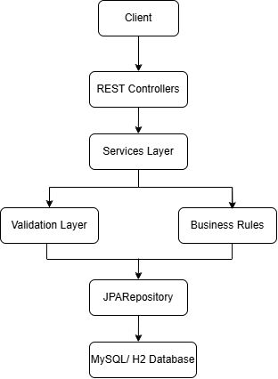
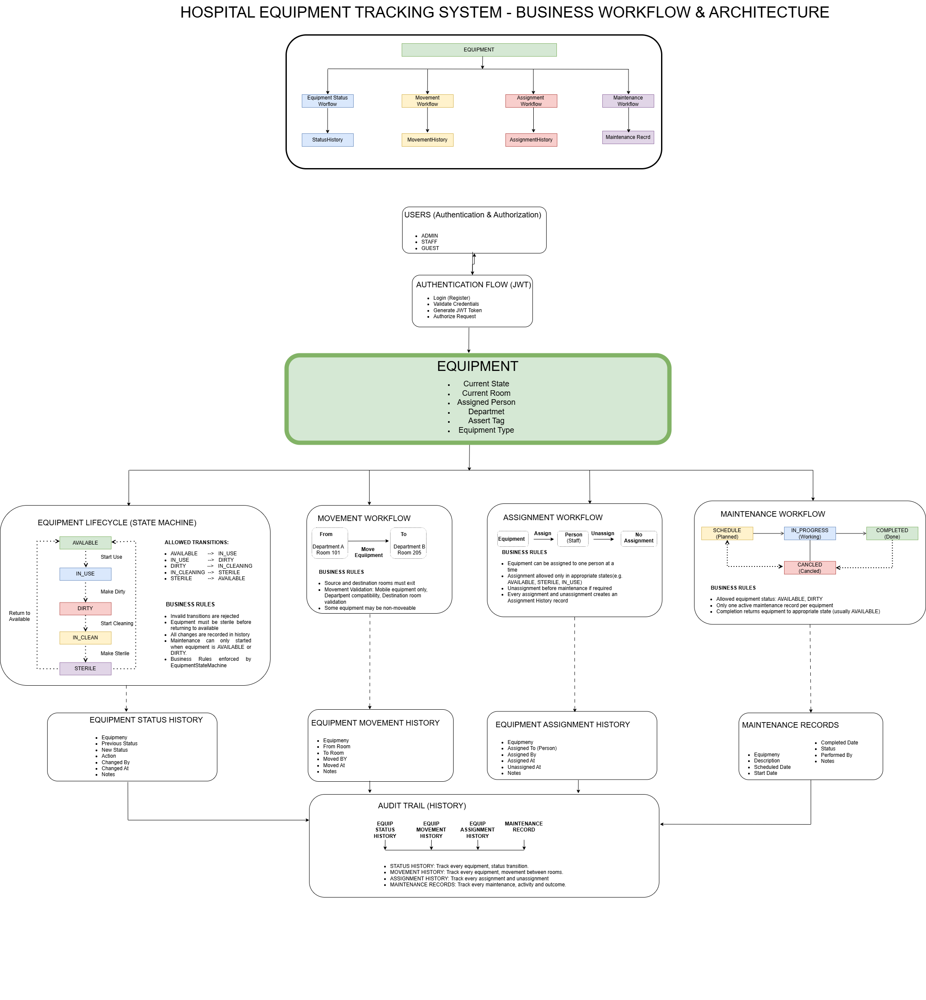
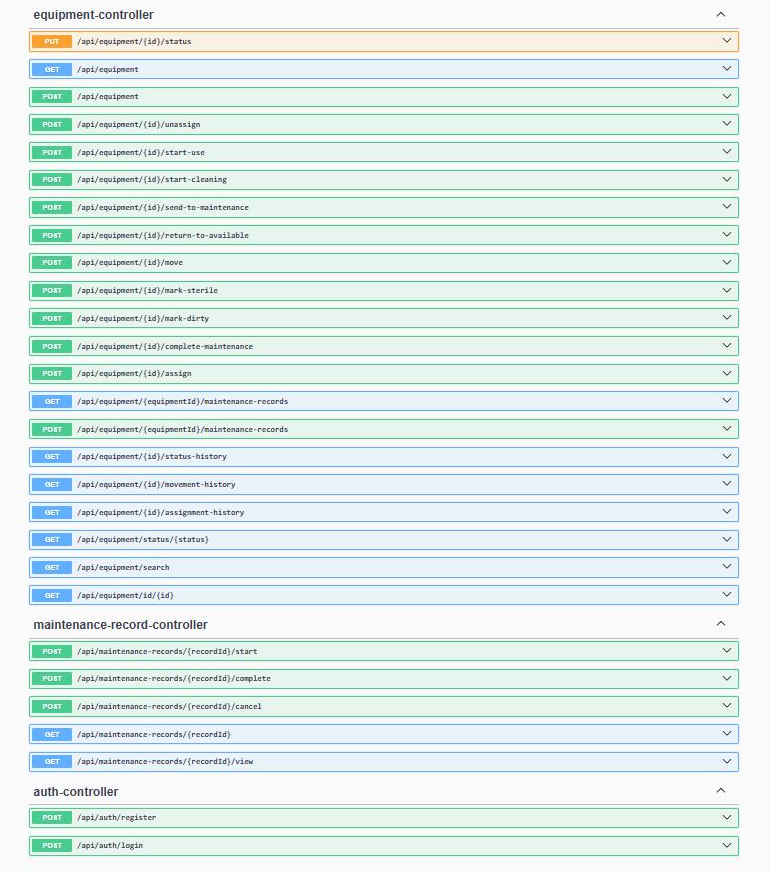
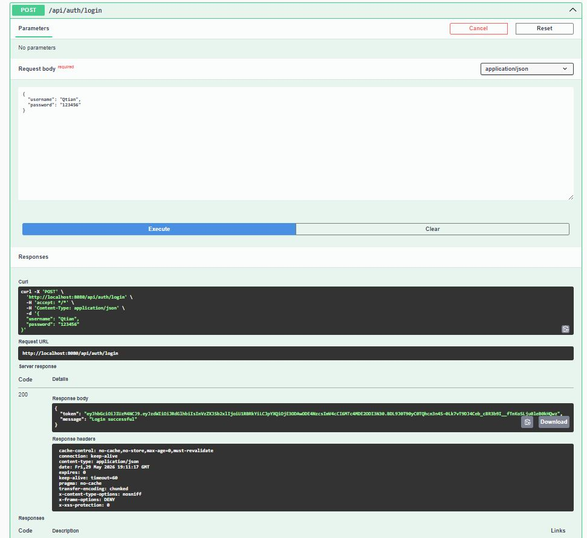

# Hospital Equipment Tracking System

> Enterprise-style backend application built with Spring Boot for managing hospital equipment lifecycle, movement, maintenance, and audit history.


---

## Highlights

✔ JWT Authentication & Role-Based Authorization

✔ Equipment Lifecycle State Machine

✔ Maintenance Workflow

✔ Equipment Movement Tracking

✔ Staff Assignment

✔ Complete Audit History

✔ RESTful API

✔ Spring Security

✔ JPA / Hibernate

✔ Unit Testing

✔ MySQL & H2 Profiles

## System Architecture
<p align="center">
  
</p>

## Hospital Workflow & Architecture


## ER Diagram

## Project Structure
```text
src
├── config                               # Spring Security & JWT configuration
│   ├── SecurityConfig                   # REST API endpoints
├── controller
│   ├── AuthController
│   ├── EquipmentController
│   └── MaintenanceRecordController
├── dto                                  # Request/Response objects
│   ├── request
│   └── response
├── exception                            # Global exception handling
├── model                                # JPA entities
├── repository                           # Spring Data JPA repositories
├── security                             # JWT filters & authentication
├── service                              # Business logic
├── validation                           # Business rule validation
└── spec                                 # Dynamic query specifications
```
## API
| Method | Endpoint                        | Description           |
| ------ | ------------------------------- | --------------------- |
| POST   | `/api/auth/login`               | User login            |
| POST   | `/api/auth/register`            | Register user         |
| GET    | `/api/equipment`                | Get all equipment     |
| POST   | `/api/equipment`                | Create equipment      |
| POST   | `/api/equipment/{id}/move`      | Move equipment        |
| POST   | `/api/equipment/{id}/assign`    | Assign equipment      |
| POST   | `/api/equipment/{id}/start-use` | Start equipment usage |






