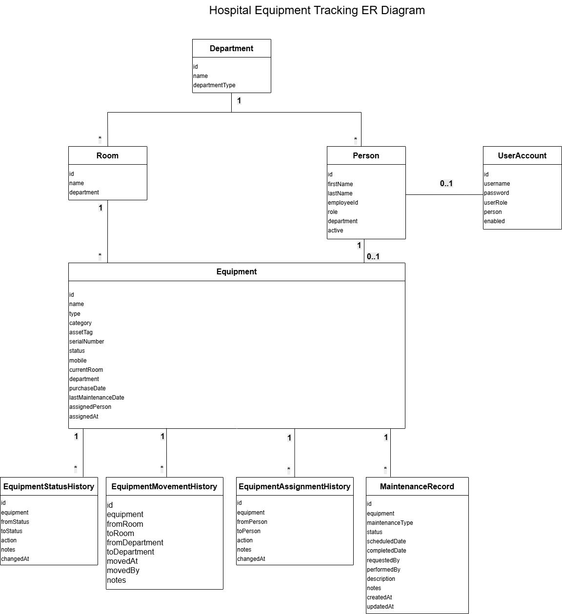

# Hospital Equipment Tracking System

> Enterprise-style backend application built with Spring Boot for managing hospital equipment lifecycle, movement, maintenance, and audit history.


---

## Highlights

✔ JWT Authentication & Role-Based Authorization

✔ Equipment Lifecycle State Machine

✔ Maintenance Workflow

✔ Equipment Movement Tracking

✔ Staff Assignment

✔ Complete Audit History

✔ RESTful API

✔ Spring Security

✔ JPA / Hibernate

✔ Unit Testing

✔ MySQL & H2 Profiles

## System Architecture
<p align="center">
  
</p>

## Hospital Workflow & Architecture


## ER Diagram



## Project Structure
```text
src
├── config                            
│   ├── SecurityConfig                  
├── controller
│   ├── AuthController
│   ├── EquipmentController
│   └── MaintenanceRecordController
├── dto                                 
│   ├── request
│   └── response
├── exception                            
├── model                               
├── repository                           
├── security                           
├── service                             
├── validation                         
└── spec                                 
```
| Package    | Description                         |
| ---------- | ----------------------------------- |
| config     | Spring Security & JWT configuration |
| controller | REST API endpoints                  |
| dto        | Request/Response objects            |
| exception  | Global exception handling           |
| model      | JPA entities                        |
| repository | Spring Data JPA repositories        |
| security   | JWT authentication & filters        |
| service    | Business logic                      |
| validation | Business rule validation            |
| spec       | Dynamic query specifications        |

## API
| Method | Endpoint                        | Description           |
| ------ | ------------------------------- | --------------------- |
| POST   | `/api/auth/login`               | User login            |
| POST   | `/api/auth/register`            | Register user         |
| GET    | `/api/equipment`                | Get all equipment     |
| POST   | `/api/equipment`                | Create equipment      |
| POST   | `/api/equipment/{id}/move`      | Move equipment        |
| POST   | `/api/equipment/{id}/assign`    | Assign equipment      |
| POST   | `/api/equipment/{id}/start-use` | Start equipment usage |


## Design Decisions

***Why separate history tables?***

Historical records are stored independently from the Equipment entity to avoid loading unnecessary historical data while preserving a complete audit trail.

***Why use a State Machine?***

Equipment status transitions follow strict business rules. Centralizing transition logic prevents invalid state changes and simplifies future maintenance.

***Why separate Maintenance Records?***

Maintenance is modeled as an independent business process rather than an equipment status, allowing detailed tracking of maintenance lifecycle and outcomes.

***Why DTOs?***

DTOs separate API contracts from persistence models, reducing coupling and improving security.

